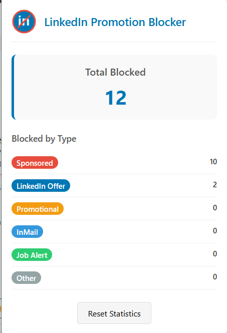
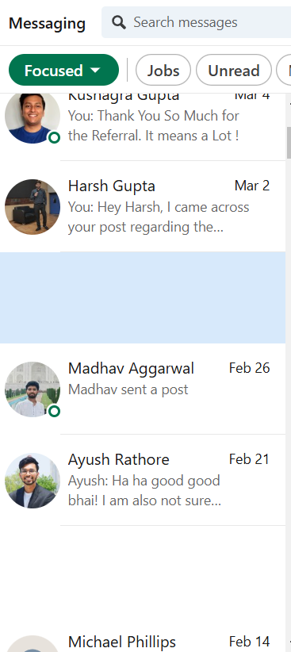

# LinkedIn Promotion Blocker

  

A Chrome extension that automatically blocks sponsored messages, promotional content, and unwanted InMail in your LinkedIn inbox, helping you maintain a cleaner and more focused messaging experience.

## Features

- 🚫 Blocks sponsored messages
- 📊 Tracks blocking statistics
- 💼 Filters LinkedIn offers
- ✉️ Blocks promotional InMail
- 🔔 Filters job alert messages
- 📈 Real-time statistics dashboard

## Screenshots

  
   
  <em>Extension popup showing blocking statistics</em>

  
   
  <em>LinkedIn inbox before and after using the extension</em>

## Installation

1. Download or clone this repository
2. Open Chrome and navigate to `chrome://extensions/`
3. Enable "Developer mode" in the top right corner
4. Click "Load unpacked" and select the extension directory
5. The extension icon should appear in your Chrome toolbar

## Usage

1. Navigate to LinkedIn and open your messages
2. The extension will automatically start blocking promotional content
3. Click the extension icon to view blocking statistics
4. Use the "Reset Statistics" button to clear your blocking history

## How It Works

The extension monitors your LinkedIn inbox and identifies promotional content using:

- Message labels (Sponsored, InMail, etc.)
- Content analysis
- Sender information

Blocked messages are hidden from view, and statistics are maintained for:

- Sponsored content
- LinkedIn offers
- Promotional messages
- InMail
- Job alerts
- Other promotional content

## Privacy

This extension:

- Does not collect any personal data
- Works entirely locally on your machine
- Does not send any data to external servers
- Only accesses LinkedIn.com

## Author

Vidit Maheshwari
- GitHub: [@vidit-maheshwari](https://github.com/vidit-maheshwari)
- LinkedIn: [Vidit Maheshwari](https://linkedin.com/in/vidit-maheshwari)
